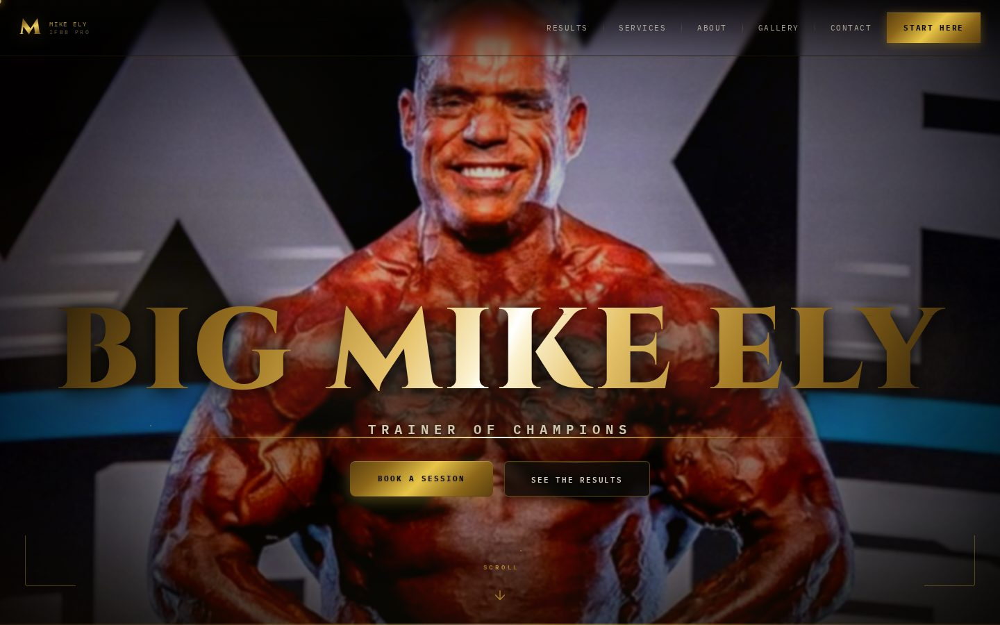
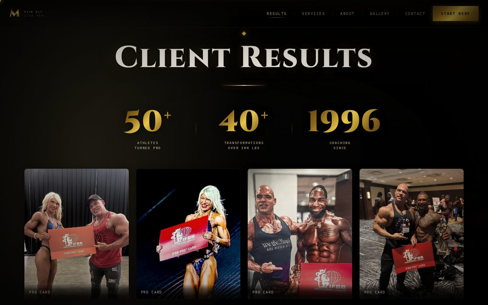
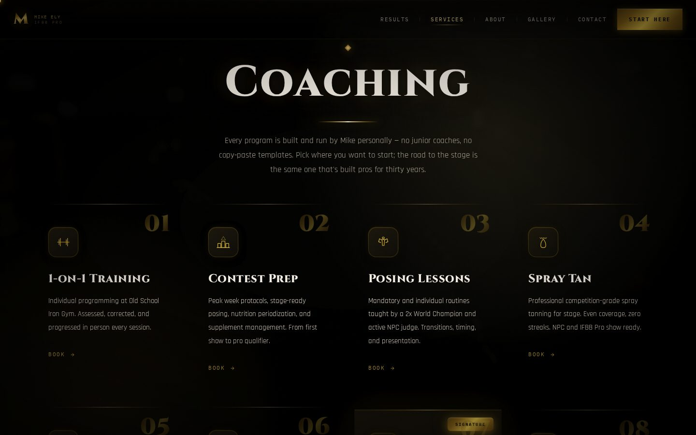
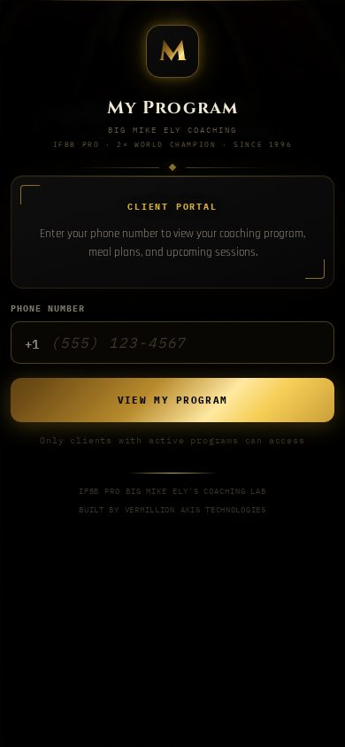
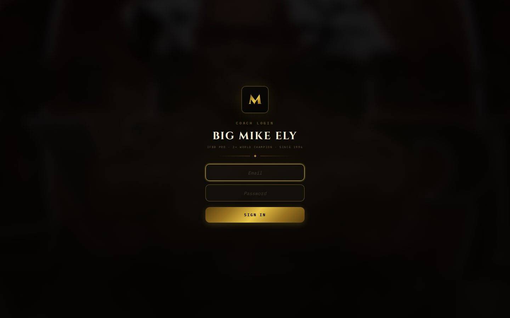

# Big Mike Ely — IFBB Pro Coaching Platform

> A production coaching platform shipped end to end for an IFBB Pro bodybuilding coach: a
> cinematic marketing site, an **offline-first coaching application**, and a **phone-verified
> client portal** — all vanilla JavaScript, backed by Supabase Edge Functions, Twilio SMS,
> and Square booking. No framework, no build step, no server to babysit.

[](https://v3vermillion.github.io/Big-Mike/)


A real coach runs his business on this every day. The coach manages clients, training
programs, meal plans, supplement protocols, session logs, and scheduling from a
single-file SPA that works fully offline and installs to the home screen. His athletes
verify by phone number and see their assigned program in a branded portal. Behind it,
16 Supabase Edge Functions handle SMS reminders, push notifications, two-factor PIN
recovery, client check-ins, and two-way Square appointment sync.

**The interesting part is the constraint:** everything is served as static files from
GitHub Pages. There is no application server. The entire product — routing, state,
rendering, PDF generation, offline persistence — runs client-side, with the cloud layer
kept strictly additive so the app never needs a connection to function.

---

## ▶ See it live

**https://v3vermillion.github.io/Big-Mike/**



<sub>The landing page: custom metallic-gold typography, full-bleed stage photography, and
scroll-triggered reveals — built for conversion and tuned for Lighthouse.</sub>

| Surface | Entry | What it does |
|---------|-------|--------------|
| **Marketing site** | `index.html` + about / services / results / gallery / contact | SEO-optimized public site with structured data, share cards, and a booking funnel |
| **Coaching app** | `app.html` | The coach's daily driver: clients, program builder, meal plans, session logs, scheduling, branded PDF export |
| **Client portal** | `portal.html` | Phone-number-verified access to each athlete's assigned program, meal plans, and upcoming sessions |
| **Onboarding** | `onboard.html` | New-client intake flow that submits straight to the database via an Edge Function |

<details>
<summary><b>More screenshots</b> — results page, services, coach login, client portal, mobile</summary>

<br>



<sub>The results page: animated stat counters (50+ athletes turned pro, 40+ 100-lb
transformations, coaching since 1996) over a branded pro-card gallery.</sub>



<sub>The services grid: numbered cards with hand-tuned iconography and per-service booking CTAs.</sub>

<table>
<tr>
<td></td>
<td></td>
</tr>
<tr>
<td><sub>Mobile-first landing — same cinematic treatment at 390px.</sub></td>
<td><sub>The client portal: athletes verify by phone number to unlock their program.</sub></td>
</tr>
</table>



<sub>The coaching application sits behind an authenticated login; everything past this
screen is the coach's private workspace.</sub>

</details>

---

## What this demonstrates

The deliberate engineering decisions behind the build:

- **Offline-first, by architecture.** All business logic runs client-side with
  `localStorage` as the source of truth. The coach can build a full program in a gym
  basement with no signal; sync happens when the network comes back. Cloud data
  (Supabase Postgres + JSONB) is a mirror, never a dependency.
- **No framework, on purpose.** The app is pure functions returning HTML strings,
  swapped via `innerHTML`, with an in-memory navigation stack instead of a router.
  Zero build step, zero dependency churn, instant loads — appropriate engineering for
  the product's actual scale, not résumé-driven architecture.
- **A real backend where it earns its keep.** 16 Supabase Edge Functions (Deno) handle
  the things a static client can't: Twilio SMS session reminders, web push
  notifications, two-factor PIN recovery, client check-in and onboarding submissions,
  and **two-way Square booking sync** so appointments made anywhere show up everywhere.
- **Security taken seriously on a static host.** Strict Content-Security-Policy,
  Postgres row-level security locked down across 7 migrations (including a dedicated
  RLS-hardening pass), PIN-gated coach access with SMS 2FA recovery, and honeypot
  fields on public forms.
- **Branded PDF export in the browser.** Training programs, meal plans, and full prep
  packets render to print-ready, branded PDFs entirely client-side (jsPDF +
  html2canvas) — no server round-trip, works offline.
- **Installable PWA.** Manifest, service worker with cache versioning, and
  theme-matched icons generated at runtime on a canvas, so the home-screen install
  matches whichever visual theme the coach picked.
- **Self-verification harness.** A Playwright-driven audit suite
  ([`scripts/`](scripts/), [`audit/`](audit/)) runs **163 assertions per pass**:
  overflow and centering checks at five viewports, orphaned `onclick` handler
  detection across ~990 handlers, double-submit lock audits, adversarial boot tests
  against corrupted localStorage, and full portal render walks.

---

## Architecture

```
┌─────────────────────────── GitHub Pages (static) ───────────────────────────┐
│                                                                             │
│  Marketing site          Coaching app (SPA)         Client portal           │
│  index/about/services…   app.html                   portal.html             │
│  SEO + share cards       localStorage = truth       phone-verified          │
│                          PDF export (jsPDF)         read-only program view  │
│                              │        ▲                    │                │
└──────────────────────────────┼────────┼────────────────────┼────────────────┘
                     debounced │ push   │ pull               │ verify + fetch
                               ▼        │                    ▼
                    ┌─────────────────────────────────────────────┐
                    │       Supabase (Postgres + JSONB, RLS)      │
                    │  16 Edge Functions (Deno):                  │
                    │  send-sms · auto-remind · send-push         │
                    │  request-2fa-code · verify-pin · reset-pin  │
                    │  square-booking · square-sync               │
                    │  submit-onboarding · submit-checkin · …     │
                    └───────┬─────────────────────┬───────────────┘
                            ▼                     ▼
                     Twilio SMS API        Square Bookings API
                  (session reminders)   (two-way appointment sync)
```

**Clean separation of surfaces:**

- **Marketing site** — static pages, no app logic. Knows nothing about clients or data.
- **Coaching app** (`app.html`) — the full product. A small `LS` utility wraps
  `localStorage`; every data store (clients, sessions, programs, meal plans, schedule)
  reads and writes through it. Cloud sync is a debounced push/pull merge on top.
- **Client portal** (`portal.html`) — a separate, read-oriented surface with its own
  service worker and manifest. Athletes never touch the coach's app.
- **Edge Functions** (`supabase/functions/`) — the only privileged code. Secrets
  (Twilio, Square, service-role keys) live here, never in the client.

A deeper engineering write-up lives in
[`docs/TECHNICAL_ARCHITECTURE.md`](docs/TECHNICAL_ARCHITECTURE.md).

---

## Tech stack

| Area | Technology |
|------|------------|
| Front end | Vanilla JavaScript (zero framework, zero build step), semantic HTML, modern CSS |
| State & persistence | `localStorage` (source of truth) + Supabase Postgres/JSONB cloud sync |
| Backend functions | Supabase Edge Functions (Deno) — 16 functions |
| Database security | Postgres row-level security, hardened across 7 SQL migrations |
| Messaging | Twilio SMS (reminders, 2FA), Web Push |
| Booking | Square Bookings API (two-way sync) |
| Documents | jsPDF + html2canvas (client-side branded PDF export) |
| Platform | Progressive Web App — manifest, service worker, runtime-generated theme icons |
| QA | Playwright audit harness — visual, functional, and security passes |
| Hosting | GitHub Pages (fully static) |

---

## Project layout

```
Big-Mike/
├── index.html            # Marketing landing page
├── about / services /    # Marketing site pages
│   results / gallery /
│   contact / 404 .html
├── app.html              # Coaching application (single-file SPA)
├── portal.html           # Client portal (phone-verified)
├── onboard.html          # New-client intake flow
├── book.html             # Booking flow (Square-backed)
├── sw.js                 # Service worker (+ portal-sw.js for the portal)
├── manifest.json         # PWA manifests (+ portal/book variants)
├── css/ js/ assets/      # Shared styles, scripts, fonts
├── img/ icons/           # Imagery and generated app icons
├── supabase/
│   ├── functions/        # 16 Deno Edge Functions (SMS, push, 2FA, Square, intake)
│   └── migrations/       # 7 SQL migrations incl. RLS lockdown & hardening
├── scripts/              # Playwright self-verification harnesses (see scripts/README.md)
├── audit/                # Scored visual/UX audit pipeline + reports
├── tools/                # Build-time page helpers
└── docs/
    ├── TECHNICAL_ARCHITECTURE.md   # Deep engineering write-up
    ├── screenshots/                # README imagery
    └── dev/                        # Build logs, audit reports, planning docs
```

---

## Run it locally

It's a static site — there is nothing to install.

```bash
git clone https://github.com/v3vermillion/Big-Mike.git
cd Big-Mike
python3 -m http.server 8080     # or: npx serve
```

Open **http://localhost:8080** for the marketing site. The coaching app (`/app.html`)
and portal (`/portal.html`) load and run offline out of the box; connecting the cloud
layer (Supabase project, Twilio, Square) is optional and configured via the Edge
Function environment — the app degrades gracefully without it.

**Run the QA harness** (requires Playwright):

```bash
node scripts/visual_audit.js     # 5 viewports × 7 pages: overflow, centering, a11y, console
node scripts/handler_audit.js    # cross-checks ~990 on* handlers against defined functions
```

---

## Design decisions & production considerations

Deliberate choices for this product, and the reasoning:

- **`localStorage` over a client-side database.** The dataset is one coach's client
  roster — small, structured, and read-hot. `localStorage` with JSON stores keeps the
  persistence layer at ~10 lines, and the Supabase JSONB mirror gives multi-device
  durability without a sync framework.
- **Single-file SPA over a bundler.** The coaching app ships as one HTML file. That's
  a feature: the deploy is a `git push`, the whole app is greppable, and there's no
  toolchain to rot. The QA harness exists precisely because this tradeoff shifts the
  burden from types to tests.
- **Secrets live only in Edge Functions.** The static client holds the Supabase anon
  key and nothing else; Twilio, Square, and service-role credentials are server-side
  environment variables. RLS enforces access even if the anon key is extracted.
- **Verification over hope.** With no framework guardrails, correctness is enforced by
  the audit suite: every interactive handler is statically cross-checked, every
  mutation path is tested for double-submit locks, and the app must boot cleanly from
  corrupted storage.

---

## About

Built by **David Kelly** — full-stack developer focused on AI product engineering and
fast, dependency-light web apps that feel premium and just work.

- GitHub: **[@v3vermillion](https://github.com/v3vermillion)**
- Also see: **[refund-agent](https://github.com/v3vermillion/refund-agent)** — a
  policy-driven AI customer-support agent (FastAPI + Anthropic tool use) with full
  reasoning traces and manipulation resistance
- Live AI product: **[fitnessforge.ai](https://fitnessforge.ai)** *(private beta —
  login-gated)* — a multi-tenant AI coaching platform (Next.js / FastAPI / Postgres +
  pgvector RAG, async job queues, a Critic-Agent evaluation loop)

This repo is a working production system designed, built, and shipped end to end —
product direction, UX, front-end engineering, data modeling, cloud integration,
security hardening, and deployment. Available for freelance and contract work.
